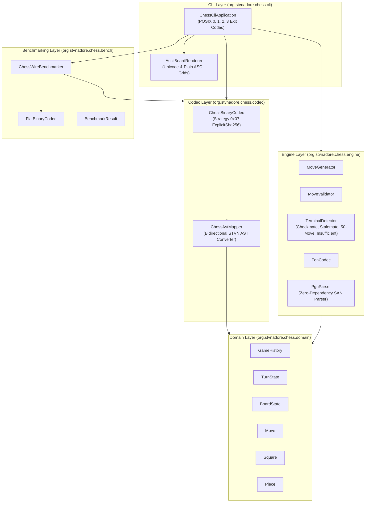

# STVN Chess Reference Application (`stvnadore-app-showcase-chess`)

[](https://github.com/chaotic3quilibrium/stvnadore-app-showcase-chess/blob/main/docs/CHESS_DEVELOPER_ADVANTAGES.md)
[](https://openjdk.org/projects/jdk/21/)
[]()
[](https://github.com/chaotic3quilibrium/stvnadore-core)
[]()

Production reference application demonstrating **STVN (Strongly Typed Value Notation)** binary encoding, zero-trust schema validation, FIDE-compliant chess rule evaluation, wire format efficiency benchmarking, and an interactive terminal ASCII/Unicode visualizer.

---

- Version: 1.0.0 - 2026.08.31

---

# Table of Contents <!-- omit in toc -->

<!-- TOC -->
* [STVN Chess Reference Application (`stvnadore-app-showcase-chess`)](#stvn-chess-reference-application-stvnadore-app-showcase-chess)
* [Table of Contents <!-- omit in toc -->](#table-of-contents----omit-in-toc---)
  * [Architecture Overview](#architecture-overview)
  * [STVN Schema & Bit-Width Design](#stvn-schema--bit-width-design)
    * [Bit-Width Allocation Rationale](#bit-width-allocation-rationale)
  * [Wire Size Benchmarking](#wire-size-benchmarking)
    * [1. Paul Morphy's 1858 Opera Game (33 plies)](#1-paul-morphys-1858-opera-game-33-plies)
    * [2. Kasparov vs Deep Blue 1997 Game 6 (37 plies)](#2-kasparov-vs-deep-blue-1997-game-6-37-plies)
    * [3. Synthetic Randomized Match (100 plies)](#3-synthetic-randomized-match-100-plies)
  * [CLI Command Reference & Usage](#cli-command-reference--usage)
    * [Exit Status Contract](#exit-status-contract)
    * [Subcommand Invocation Examples](#subcommand-invocation-examples)
  * [Zero-Trust Security Model](#zero-trust-security-model)
  * [Interactive Terminal Replay Visualizer](#interactive-terminal-replay-visualizer)
  * [PGN Import & Interoperability](#pgn-import--interoperability)
  * [Build & Test Execution](#build--test-execution)
    * [Prerequisites](#prerequisites)
    * [Build Commands](#build-commands)
* [Support](#support)
  * [License](#license)
    * [GNU AFFERO GENERAL PUBLIC LICENSE](#gnu-affero-general-public-license)
    * [REALLY HATE the GNU AFFERO GENERAL PUBLIC LICENSE, a.k.a. AGPLv3?](#really-hate-the-gnu-affero-general-public-license-aka-agplv3)
    * [FYI, I'd prefer to move stvnadore-app-showcase-chess to an Apache 2.0 license](#fyi-id-prefer-to-move-stvnadore-app-showcase-chess-to-an-apache-20-license)
    * [I'm not looking to win the lottery, I just don't want to work for free](#im-not-looking-to-win-the-lottery-i-just-dont-want-to-work-for-free)
<!-- TOC -->

---

## Architecture Overview

The system is organized into modular layers enforcing a strict separation of concerns across domain modeling, chess rules, binary serialization, benchmarking, and interactive CLI presentation:



---

## STVN Schema & Bit-Width Design

The canonical schema definition is located at `src/main/resources/schemas/chess_turn.stvn_inclf`. STVN minimizes wire footprint by packing domain-constrained numeric types and enums to their exact required bit widths:

```stvn
{
  // chess_turn.stvn_inclf
  :defs {
    // --- Board Coordinates & Pieces ---
    :File             :Enum [ #A #B #C #D #E #F #G #H ]
    :Rank             { #minIncl 1 #maxIncl 8 } :Uint4
    :Square           :Tuple( :File :Rank )

    :Color            :Enum [ #WHITE #BLACK ]
    :PieceRole        :Enum [ #PAWN #KNIGHT #BISHOP #ROOK #QUEEN #KING ]
    :Piece            :Tuple( :Color :PieceRole )

    // --- Move Semantics & Promotion Rules ---
    :PromotionRole    :Enum [ #KNIGHT #BISHOP #ROOK #QUEEN ]
    :PromotionOption  :Option( :PromotionRole )
    :IsCapture        :Boolean
    :HalfmovesSincePawnOrCapture { #maxIncl 100 } :Uint7
    :Move             :Tuple( :Square :Square :PromotionOption :IsCapture :HalfmovesSincePawnOrCapture )

    // --- Turn Evaluation & State Tracking ---
    :TurnNumber       { #minIncl 1 } :Uint10
    :ForsythEdwardsNotation :String
    :CentipawnEvaluation :Int16
    :TurnState        :Tuple( :TurnNumber :Color :Move :ForsythEdwardsNotation :CentipawnEvaluation )

    // --- Match Metadata & Outcomes ---
    :MatchId          :String
    :WhitePlayer      :String
    :BlackPlayer      :String
    :TerminalOutcome  :Enum [ #WHITE_WIN #BLACK_WIN #DRAW ]
    :MatchResult      :Option( :TerminalOutcome )
    :GameHistory      :Tuple( :MatchId :WhitePlayer :BlackPlayer :Seq( :TurnState ) :MatchResult )
  }
}
```

### Bit-Width Allocation Rationale

| Type Name                      | STVN Type  | Valid Range                         | Wire Bits | Engineering Rationale                                                                                                                                                                                                                                    |
|:-------------------------------|:-----------|:------------------------------------|:----------|:---------------------------------------------------------------------------------------------------------------------------------------------------------------------------------------------------------------------------------------------------------|
| `:Rank`                        | `Uint4`    | $1 \dots 8$                         | 4 bits    | Standard chessboard ranks span 1 to 8. A 4-bit unsigned integer supports 16 states ($0 \dots 15$), tightly containing 8 ranks without wasting high-order bits.                                                                                           |
| `:HalfmovesSincePawnOrCapture` | `Uint7`    | $0 \dots 100$                       | 7 bits    | FIDE Article 9.3 (50-move rule) triggers after 50 full moves (100 plies) without pawn move or capture. `Uint7` ($0 \dots 127$) precisely bounds the 100-ply limit.                                                                                       |
| `:TurnNumber`                  | `Uint10`   | $1 \dots 1023$                      | 10 bits   | Classical chess matches average 40–80 plies; the longest historical tournament match was 538 plies (Nikolić vs. Arsović, 1989). `Uint10` ($0 \dots 1023$) provides 1.9x safety margin over the longest historical game while avoiding 16-bit allocation. |
| `:CentipawnEvaluation`         | `Int16`    | $-32,768 \dots 32,767$              | 16 bits   | Engine evaluations are expressed in centipawns ($100 = 1.0\text{ pawn}$). Positional advantages range between $\pm 1,500$; mate scores use sentinels ($\pm 10,000$). `Int16` covers all evaluations without allocating 32 bits.                          |
| `:File`                        | `Enum [8]` | `#A` to `#H`                        | 3 bits    | 8 board files fit within a 3-bit discriminant.                                                                                                                                                                                                           |
| `:Color`                       | `Enum [2]` | `#WHITE`, `#BLACK`                  | 1 bit     | 2 player colors fit in a single bit.                                                                                                                                                                                                                     |
| `:PieceRole`                   | `Enum [6]` | `#PAWN` to `#KING`                  | 3 bits    | 6 piece roles fit in a 3-bit discriminant.                                                                                                                                                                                                               |
| `:PromotionRole`               | `Enum [4]` | `#KNIGHT` to `#QUEEN`               | 2 bits    | 4 promotion candidates (excluding pawn and king) fit in 2 bits.                                                                                                                                                                                          |
| `:IsCapture`                   | `Boolean`  | `#TRUE`, `#FALSE`                   | 1 bit     | Binary capture flag.                                                                                                                                                                                                                                     |
| `:TerminalOutcome`             | `Enum [3]` | `#WHITE_WIN`, `#BLACK_WIN`, `#DRAW` | 2 bits    | 3 terminal outcome variants fit in 2 bits.                                                                                                                                                                                                               |

---

## Wire Size Benchmarking

Quantitative wire size comparison executed across canonical matches using `ChessWireBenchmarker`:

### 1. Paul Morphy's 1858 Opera Game (33 plies)
| Wire Format                     |  Raw Bytes  | Bytes / Ply | GZIP Compressed Bytes | STVN Size Delta |
|:--------------------------------|:-----------:|:-----------:|:---------------------:|:---------------:|
| **STVN Binary (Strategy 0x07)** | **2,990 B** | **90.61 B** |      **1,224 B**      |  **BASELINE**   |
| JSON (Compact)                  |   8,948 B   |  271.15 B   |        1,046 B        |     +66.6%      |
| JSON (Pretty)                   |  14,426 B   |  437.15 B   |        1,151 B        |     +79.3%      |
| Raw Flat Binary (No Schema)     |   2,537 B   |   76.88 B   |         716 B         |     -17.9%      |

### 2. Kasparov vs Deep Blue 1997 Game 6 (37 plies)
| Wire Format                     |  Raw Bytes  | Bytes / Ply | GZIP Compressed Bytes | STVN Size Delta |
|:--------------------------------|:-----------:|:-----------:|:---------------------:|:---------------:|
| **STVN Binary (Strategy 0x07)** | **3,470 B** | **93.78 B** |      **1,373 B**      |  **BASELINE**   |
| JSON (Compact)                  |  10,135 B   |  273.92 B   |        1,144 B        |     +65.8%      |
| JSON (Pretty)                   |  16,273 B   |  439.81 B   |        1,274 B        |     +78.7%      |
| Raw Flat Binary (No Schema)     |   2,956 B   |   79.89 B   |         796 B         |     -17.4%      |

### 3. Synthetic Randomized Match (100 plies)
| Wire Format                     |  Raw Bytes  | Bytes / Ply | GZIP Compressed Bytes | STVN Size Delta |
|:--------------------------------|:-----------:|:-----------:|:---------------------:|:---------------:|
| **STVN Binary (Strategy 0x07)** | **8,728 B** | **87.28 B** |      **3,399 B**      |  **BASELINE**   |
| JSON (Compact)                  |  26,809 B   |  268.09 B   |        2,786 B        |     +67.4%      |
| JSON (Pretty)                   |  43,342 B   |  433.42 B   |        3,020 B        |     +79.9%      |
| Raw Flat Binary (No Schema)     |   7,447 B   |   74.47 B   |        2,029 B        |     -17.2%      |

> **Key Takeaway:** STVN Binary achieves a **~67.4% raw wire reduction over Compact JSON** and a **~79.9% reduction over Pretty JSON** while providing strong typed validation and cryptographic zero-trust CAS verification.

---

## CLI Command Reference & Usage

The application provides a single unified entry point via `ChessCliApplication` supporting 6 subcommands and enforcing strict POSIX-compliant status codes:

### Exit Status Contract
| Exit Code | Classification           | Description                                                             |
|:---------:|:-------------------------|:------------------------------------------------------------------------|
|    `0`    | **Success**              | Command completed successfully.                                         |
|    `1`    | **I/O / Argument Error** | Invalid CLI arguments, missing parameters, or missing file paths.       |
|    `2`    | **Security Violation**   | Zero-trust integrity alert: `PoisonedRegistryPayloadException` raised.  |
|    `3`    | **Engine Violation**     | Chess rule error: `IllegalMoveException` or `PgnParseException` raised. |

### Subcommand Invocation Examples

```bash
# 1. Simulate a validated chess match and serialize to Strategy 0x07 binary (.stvn_bin)
./mvnw exec:java -D"exec.mainClass=org.stvnadore.chess.cli.ChessCliApplication" -D"exec.args=simulate game_output.stvn_bin"

# 2. Verify binary schema CAS hash integrity and inspect decoded metadata
./mvnw exec:java -D"exec.mainClass=org.stvnadore.chess.cli.ChessCliApplication" -D"exec.args=verify game_output.stvn_bin"

# 3. Simulate zero-trust attack (corrupt header hash byte) and assert exit code 2
./mvnw exec:java -D"exec.mainClass=org.stvnadore.chess.cli.ChessCliApplication" -D"exec.args=poison game_output.stvn_bin"

# 4. Execute multi-format wire benchmarking suite across historical and synthetic games
./mvnw exec:java -D"exec.mainClass=org.stvnadore.chess.cli.ChessCliApplication" -D"exec.args=benchmark"

# 5. Interactively replay a binary match in terminal with Unicode graphics
./mvnw exec:java -D"exec.mainClass=org.stvnadore.chess.cli.ChessCliApplication" -D"exec.args=replay game_output.stvn_bin --delay 300"

# 6. Replay in step-by-step mode with plain ASCII fallback for headless CI terminals
./mvnw exec:java -D"exec.mainClass=org.stvnadore.chess.cli.ChessCliApplication" -D"exec.args=replay game_output.stvn_bin --step --ascii"

# 7. Import standard PGN file, validate legal moves, and compile into Strategy 0x07 binary
./mvnw exec:java -D"exec.mainClass=org.stvnadore.chess.cli.ChessCliApplication" -D"exec.args=pgn-import match.pgn match.stvn_bin"
```

---

## Zero-Trust Security Model

STVN enforces cryptographic schema pinning at the binary frame boundary using **Strategy 0x07 (`ExplicitSha256`)**:

```
+---------------------------------------------------------------------------------------------------+
|                            STRATEGY 0x07 BINARY FRAME LAYOUT                                      |
+---------------------------------------------------------------------------------------------------+
| Bytes 0..3   | Magic Header: ASCII "STVN" (0x53, 0x54, 0x56, 0x4E)                                |
| Byte 4       | Strategy Identifier: 0x07 (ExplicitSha256)                                         |
| Bytes 5..36  | 32-Byte SHA-256 Digest of canonical schema (64-char hex CAS identifier)            |
| Bytes 37..N  | Serialized Value Payload (Typed AST Nodes with bit-packed fields)                  |
+---------------------------------------------------------------------------------------------------+
```

When a client decodes a `.stvn_bin` binary file:
1. `StvnBinaryDecoder.open()` reads the 37-byte header and extracts the embedded SHA-256 digest.
2. The decoder computes the SHA-256 digest of the locally resolved schema.
3. If a single bit in the 32-byte digest differs, the decoder immediately halts and throws `PoisonedRegistryPayloadException`.
4. Body bytes are never parsed if the header digest check fails.

---

## Interactive Terminal Replay Visualizer

The `replay` subcommand renders board frames with dynamic move highlighting, turn metrics, and material balance:

```
================================================================================
Turn: 7 | Active: WHITE | Move: h5 -> f7 (Qxf7#) | Eval: +100.00
FEN: r1bqkbnr/pppp1Qpp/2n5/4p3/2B1P3/8/PPPP1PPP/RNB1K1NR b KQkq - 0 4
--------------------------------------------------------------------------------
    a    b    c    d    e    f    g    h  
  +----+----+----+----+----+----+----+----+
8 | ♜ |    | ♝ | ♛ | ♚ | ♝ | ♞ | ♜ | 8
  +----+----+----+----+----+----+----+----+
7 | ♟ | ♟ | ♟ | ♟ |    | ♕ | ♟ | ♟ | 7
  +----+----+----+----+----+----+----+----+
6 |    |    | ♞ |    |    |    |    |    | 6
  +----+----+----+----+----+----+----+----+
5 |    |    |    |    | ♟ |    |    |    | 5
  +----+----+----+----+----+----+----+----+
4 |    |    | ♗ |    | ♙ |    |    |    | 4
  +----+----+----+----+----+----+----+----+
3 |    |    |    |    |    |    |    |    | 3
  +----+----+----+----+----+----+----+----+
2 | ♙ | ♙ | ♙ | ♙ |    | ♙ | ♙ | ♙ | 2
  +----+----+----+----+----+----+----+----+
1 | ♖ | ♘ | ♗ |    | ♔ |    |    | ♖ | 1
  +----+----+----+----+----+----+----+----+
    a    b    c    d    e    f    g    h  
Material Balance: White captured 1 pawn(s) | Black captured 0 piece(s)
================================================================================
```

---

## PGN Import & Interoperability

The zero-dependency `PgnParser` imports standard FIDE PGN records into validated `GameHistory` models:
- Parses standard header tags (`[Event ""]`, `[White ""]`, `[Black ""]`, `[Result ""]`).
- Strips inline comments (`{ ... }`), line comments (`; ...`), annotations (`!`, `?`), and NAGs (`$1`).
- Resolves Standard Algebraic Notation (SAN) with full disambiguation by file (`Nbd7`), rank (`R1d2`), or both (`Qh4e1`).
- Normalizes castling syntax variations (`O-O`, `0-0`, `O-O-O`, `0-0-0`).
- Validates pawn promotion roles (`=Q`, `=R`, `=B`, `=N`).
- Rejects illegal moves with structured `IllegalMoveException` (exit code `3`).

---

## Build & Test Execution

### Prerequisites
- JDK 21 LTS or higher
- Maven 3.9+ (or included `./mvnw`)

### Build Commands
```bash
# Clean and compile with strict zero-warning enforcement (-Werror, -Xlint:all)
./mvnw clean compile

# Execute complete test suite (Domain, Engine, Codec, CLI, Bench, and Fuzzing)
./mvnw test

# Package executable JAR
./mvnw clean package
```

---

# Support

**Website:** <https://github.com/chaotic3quilibrium/stvnadore-app-showcase-chess>

**Email:** [jim.oflaherty.jr@gmail.com](mailto:jim.oflaherty.jr+sacrms@gmail.com)

---

## License

### [GNU AFFERO GENERAL PUBLIC LICENSE](https://github.com/chaotic3quilibrium/stvnadore-app-showcase-chess/blob/main/LICENSE.md)

The stvnadore-app-showcase-chess files are free software: you can redistribute it and/or modify it under the terms of the GNU Affero General Public License as published by the Free Software Foundation, either version 3 of the License, or (at your option) any later version.

This program is distributed in the hope that it will be useful, but WITHOUT ANY WARRANTY; without even the implied warranty of MERCHANTABILITY or FITNESS FOR A PARTICULAR PURPOSE. See the GNU Affero General Public License for more details.

You should have received a copy of the [GNU Affero General Public License](https://www.gnu.org/licenses/agpl-3.0.en.html) along with this program. If not, see <https://www.gnu.org/licenses/>.

---

### REALLY HATE the GNU AFFERO GENERAL PUBLIC LICENSE, a.k.a. AGPLv3?

- It was chosen entirely because of Amazon's/AWS's (and many other wealthy corporations) historic abuses and exploitation of FOSS (Free Open Source Software)
- No Worries, I'd Love to Work with You

If the AGPLv3 doesn't work for you, I would LOVE to work with you to generate a **custom/different/commercial/non-profit/government license** for stvnadore-app-showcase-chess.

Please email: <jim.oflaherty.jr+sacrml@gmail.com>, letting us know what license you would prefer. I am happy to discuss this with you.

---

### FYI, I'd prefer to move stvnadore-app-showcase-chess to an Apache 2.0 license

---

### I'm not looking to win the lottery, I just don't want to work for free