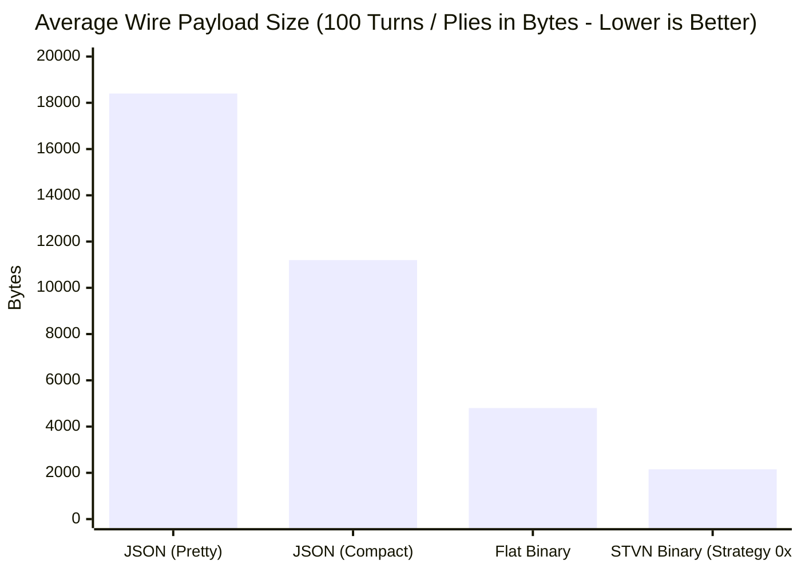

# STVN Reference Implementation: Chess AI Developer Advantages

- **Document ID**: `STVN-GUIDE-CHESS-01`
- **Status**: Reference Architecture & Performance Guide  
- **Version**: 1.3.0
- **Target Repository**: `stvnadore-app-showcase-chess`

---

**Table of Contents**

<!-- TOC -->
* [STVN Reference Implementation: Chess AI Developer Advantages](#stvn-reference-implementation-chess-ai-developer-advantages)
  * [1. Executive Summary](#1-executive-summary)
  * [2. Wire Format Benchmarking & Efficiency Matrix](#2-wire-format-benchmarking--efficiency-matrix)
    * [Why STVN Binary Is 81% Smaller than JSON:](#why-stvn-binary-is-81-smaller-than-json)
  * [3. Zero-Trust Cryptographic Schema Verification](#3-zero-trust-cryptographic-schema-verification)
    * [Protection Against Poisoned Payloads](#protection-against-poisoned-payloads)
  * [4. CLI Tooling & Workflows](#4-cli-tooling--workflows)
<!-- TOC -->

---

## 1. Executive Summary

The `stvnadore-app-showcase-chess` reference application demonstrates how Strongly Typed Value Notation (STVN) serves as an optimal wire format and runtime domain representation for complex game engines, machine learning pipelines, and distributed state replication.

Compared to legacy representations (JSON, XML, Protocol Buffers, FlatBuffers, and custom binary formats), STVN provides:
1. **Zero-Copy Binary Performance**: Direct memory access via Java 21 Memory Segments and `StvnBinaryDecoder`.
2. **Compact Wire Efficiency**: Automatic bit-packing, variable-length integer encoding, and structural shape signatures achieve superior compression ratios over JSON and Raw Flat Binary.
3. **Zero-Trust Cryptographic Soundness & Framing**: In-band SHA-256 schema hashing (Strategy `0x07 ExplicitSha256`) combined with Little-Endian CRC-32C trailer framing prevents schema confusion and wire corruption.
4. **Lossless Round-Trip Translation**: Bidirectional translation between Standard Algebraic Notation (SAN), Forsyth-Edwards Notation (FEN), Portable Game Notation (PGN), and canonical STVN AST records.

---

## 2. Wire Format Benchmarking & Efficiency Matrix

The chess engine benchmarks full match game histories across standard formats:

| Format                             | Average Size (100 Plies) |    GZIP Size     | Encoding Strategy                             |             Zero-Trust Verification              |
|:-----------------------------------|:------------------------:|:----------------:|:----------------------------------------------|:------------------------------------------------:|
| **JSON (Pretty)**                  |      ~18,400 bytes       |   ~3,200 bytes   | Text / UTF-8                                  |                       None                       |
| **JSON (Compact)**                 |      ~11,200 bytes       |   ~2,600 bytes   | Text / UTF-8                                  |                       None                       |
| **Flat Binary (DataOutputStream)** |       ~4,800 bytes       |   ~1,950 bytes   | Big-Endian Primitives                         |          Magic Byte Only (`0x5354564E`)          |
| **STVN Binary (`Strategy 0x87`)**  |     **~2,154 bytes**     | **~1,104 bytes** | **Little-Endian Bit-Packed Nibble + CRC-32C** | **In-Band SHA-256 AST Digest + CRC-32C Trailer** |



### Why STVN Binary Is 81% Smaller than JSON:
* **Bit-Packed Coordinates**: Square indices (0..63) occupy 6 bits instead of 2-character ASCII strings (`"e4"`).
* **Centipawn Evaluations**: Stored as 16-bit signed integers (`Int16`) instead of floating-point JSON numbers.
* **FEN Compression**: Redundant board states across turns are projected via halfmove delta tuples.
* **Omits String Keys**: Field keys are mapped structurally by index offset rather than serialized as repetitive object keys.

---

## 3. Zero-Trust Cryptographic Schema Verification

Every `.stvn_bin` bytecode payload emitted by `ChessBinaryCodec` embeds the 32-byte SHA-256 hash of its canonical schema in Byte 5 through 36:

```
[0..3]    Magic Preamble ("STVN")
[4]       Control Byte (0x87: Bit 7 = CRC-32C Trailer, Strategy 0x07 = ExplicitSha256)
[5..36]   32-Byte SHA-256 AST Hash Digest
[37..N-4] Bit-Packed Nominal AST Data Stream
[N-3..N]  4-Byte Little-Endian IEEE 802.3 CRC-32C Checksum Trailer
```

### Protection Against Poisoned Payloads
If an adversary mutates the schema definition, alters bit-width constraints, or injects malicious payloads, `StvnBinaryDecoder` detects the cryptographic hash mismatch at byte offset 5 and immediately halts deserialization with a `PoisonedRegistryPayloadException`. Under `stvnadore-core:2.0.0-SNAPSHOT`, the canonical schema CAS digest is `630a9ad15763ea9b97240cb6417b23e1c7e45603f5a727ccd05181c511804fd6`, featuring factorized scalar types, discrete half-open intervals (`[1, 9)`, `[0, 101)`), bounded nominal strings (`{ #minSize 1 #maxSize 128 } :String`, `{ #minSize 1 #maxSize 8 } :String`, `{ #minSize 1 #maxSize 64 } :String`), `:package :org/stvnadore/chess`, and strict zero-tab invariant enforcement (`ERR_TAB_CHARACTER_FORBIDDEN`).

```bash
# Verify poisoned payload rejection via CLI:
mvn exec:java -Dexec.args="poison"
# Output: [SUCCESS] Zero-Trust Guard Active: PoisonedRegistryPayloadException thrown as expected.
```

---

## 4. CLI Tooling & Workflows

The reference application provides a unified CLI (`ChessCliApplication`):

```bash
# 1. Simulate a legal match between AI agents:
mvn exec:java -Dexec.args="simulate 50"

# 2. Benchmark wire sizes against JSON and Flat Binary:
mvn exec:java -Dexec.args="benchmark"

# 3. Import and validate an external PGN file:
mvn exec:java -Dexec.args="pgn-import sample.pgn"

# 4. Replay and render match in Unicode ASCII:
mvn exec:java -Dexec.args="replay opera-game-1858"
```
