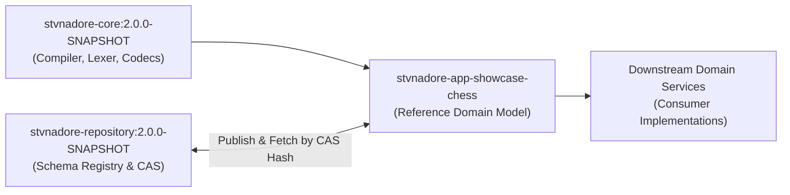
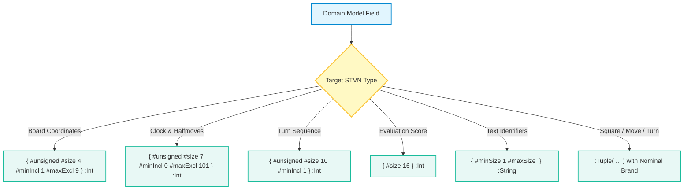
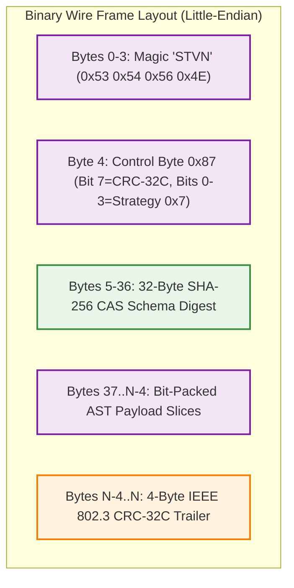

# STVN Architecture Specification: Chess Reference Application & VOP Domain Standards

**Document ID:** `STVN-SPEC-CHESS-01`  
**Status:** Canonical Architecture Specification  
**Version:** `1.0.0-PROPOSAL`  
**Target Repository:** `stvnadore-app-showcase-chess` (`ij_stvnadore_example_chess`)  
**Target Version Baseline:** `2.0.0-PROPOSAL`  
**Governing Standard:** Simplified Technical English (STE-01 through STE-07)  
**Foundational Baselines:** `STVN_LANGUAGE_SPEC.md` (v1.3.1), `STVN-VOP-MANIFESTO.md`, [`STVN_REPOSITORY_SPEC.md`](file:///c:/Projects/Java/stvnadore/ij_stvnadore_repository/docs/architecture/STVN_REPOSITORY_SPEC.md)  

---

## 1. Scope & Ecosystem Authority

### 1.1 The Ecosystem Role of the Chess Showcase

The STVN Chess Showcase application (`stvnadore-app-showcase-chess`) serves as the canonical reference implementation of Value-Oriented Programming (VOP) and STVN wire protocols. Downstream microservices, client libraries, and distributed engines replicate its architectural patterns.

The chess reference application demonstrates four core capabilities:
1. **Domain Modeling with Zero Nulls:** Models the complete rules of chess under FIDE standards using immutable Java records and sealed algebraic types.
2. **Lossless Bidirectional AST Mapping:** Converts domain models to and from STVN Abstract Syntax Tree (`StvnValue`) representations without data loss.
3. **Zero-Trust Binary Framing:** Encodes game states using Binary Encoding Strategy `0x7` (`ExplicitSha256`) with IEEE 802.3 CRC-32C trailer validation.
4. **Registry Client Integration:** Publishes and retrieves canonical schema envelopes from `stvnadore-repository` by 32-byte SHA-256 CAS hash.



### 1.2 Multi-Tier Integration Architecture

The showcase integrates three ecosystem layers:
- **Core SDK Tier (`stvnadore-core`):** Supplies `StvnCompiler`, `StvnSchemaHasher`, `StvnBinaryEncoder`, and `StvnBinaryDecoder`.
- **Repository Registry Tier (`stvnadore-repository`):** Provides Content-Addressable Storage (CAS) and enforces the Nominal Bijectivity Invariant ($1:1$ Law) via `version_catalog`.
- **Domain Showcase Tier (`stvnadore-app-showcase-chess`):** Integrates the FIDE move validation engine, AST mapper, wire benchmarker, and terminal CLI.

---

## 2. Domain-to-STVN Type Mapping Invariants (STVN 2.0.0 Standards)

The chess domain schema (`src/main/resources/schemas/chess_turn.stvn_inclf`) defines all types in `:package :org/stvnadore/chess`. Under STVN 2.0.0, the schema conforms to strict scalar factorization, discrete half-open intervals, and string cardinality rules.



### 2.1 Board Coordinates & Scalar Factorization

Legacy STVN 1.x compound integer tokens (`:Uint4`, `:Uint7`, `:Uint10`, `:Int16`) are eliminated. The schema declares base `:Int` paired with explicit metadata facets:

1. **Board Column File (`:File`):**
   ```stvn
   :File :Enum [ #A #B #C #D #E #F #G #H ]
   ```
2. **Board Row Rank (`:Rank`):**
   - Declares a 4-bit unsigned integer constrained to ranks 1 through 8.
   - Enforces half-open discrete interval governance: `#minIncl 1 #maxExcl 9`.
   - Prohibits `#maxIncl` and `#minExcl`.
   ```stvn
   :Rank { #unsigned #size 4 #minIncl 1 #maxExcl 9 } :Int
   ```
3. **Board Square (`:Square`):**
   - Defined as a nominal product tuple pairing `:File` and `:Rank`.
   ```stvn
   :Square :Tuple( :File :Rank )
   ```

### 2.2 Move Tracking & Discrete Half-Open Intervals

Discrete numeric types reject closed upper bounds (`#maxIncl`) and open lower bounds (`#minExcl`). All integer ranges use half-open intervals $[minIncl, maxExcl)$:

1. **Fifty-Move Rule Counter (`:HalfmovesSincePawnOrCapture`):**
   - Tracks plies since last capture or pawn move ($0 \le h \le 100$).
   - Formulated as a 7-bit unsigned integer with half-open bound $[0, 101)$:
   ```stvn
   :HalfmovesSincePawnOrCapture { #unsigned #size 7 #minIncl 0 #maxExcl 101 } :Int
   ```
2. **Turn Sequence Number (`:TurnNumber`):**
   - Tracks positive 1-based turn numbers ($t \ge 1$).
   - Formulated as a 10-bit unsigned integer:
   ```stvn
   :TurnNumber { #unsigned #size 10 #minIncl 1 } :Int
   ```
3. **Engine Evaluation Score (`:CentipawnEvaluation`):**
   - Represents engine advantage in centipawns ($-32768 \le eval \le 32767$).
   - Formulated as a 16-bit signed integer:
   ```stvn
   :CentipawnEvaluation { #size 16 } :Int
   ```

### 2.3 String Cardinality Governance (MCT § 3.1.3)

Under MCT § 3.1.3, the `#size` facet represents physical memory bit-width and is prohibited on `:String`. Applying `#size` to `:String` emits `ERR_INVALID_METADATA_FACET`. All string types express character capacity through logical `#minSize` and `#maxSize` bounds:

1. **Algebraic Move String (`:SanMoveString`):**
   ```stvn
   :SanMoveString { #minSize 1 #maxSize 8 } :String
   ```
2. **Match and Player Identifiers (`:MatchId`, `:PlayerName`):**
   ```stvn
   :MatchId    { #minSize 1 #maxSize 64 } :String
   :PlayerName { #minSize 1 #maxSize 64 } :String
   ```
3. **Board State String (`:FenStringFixed`, `:ForsythEdwardsNotation`):**
   ```stvn
   :FenStringFixed { #minSize 1 #maxSize 128 } :String
   :ForsythEdwardsNotation :FenStringFixed
   ```

---

## 3. The Anti-Fragile Nominal AST Invariant

### 3.1 Prohibition of Blind Positional Indexing

In Value-Oriented Programming (VOP), structural tuples must not be deserialized blindly. Code that accesses `tuple.elements().get(i)` without verifying element type and nominal schema creates fragile systems prone to `ClassCastException` and silent type confusion.

The repository establishes the **Anti-Fragile Nominal AST Invariant**:
- Every mapper, codec, and visitor must verify the nominal schema identity (`ast.schema().aliasName()`) before extracting fields.
- Mappers must verify that `ast.schema().aliasName()` matches expected nominal aliases (`:GameHistory`, `:TurnState`, `:Move`, `:Square`, `:Piece`).
- Mappers must verify structural arity ($M == N$) and assert typed child variants.

### 3.2 Error Localization with `NominalSchemaMismatchException`

When an AST node fails nominal assertions, mappers must not crash with generic exceptions. Mappers must throw `NominalSchemaMismatchException`:

```java
package org.stvnadore.chess.codec;

public class NominalSchemaMismatchException extends RuntimeException {
  private final String expectedAlias;
  private final String actualAlias;
  private final String path;
  private final transient StvnValue offendingNode;
  ...
}
```

The exception pins:
1. **Expected Alias:** The nominal type expected by the domain model (e.g. `":Square"`).
2. **Actual Alias:** The alias found on the node, or `"<unnamed>"` if unbranded.
3. **Structural Path:** The exact path within the aggregate tree (e.g. `"root.turns[0].move.from"`).
4. **Offending Node:** The exact `StvnValue` AST instance that triggered the failure.

---

## 4. Zero-Trust Client Strategy 0x7 Wire Protocol

The chess application uses Binary Encoding Strategy `0x7` (`ExplicitSha256`) for network replication, persistence, and inter-process communication.



### 4.1 Byte 4 Control Byte Framing

Strategy `0x7` wire frames specify Byte 4 as follows:
- **Bits 0–3 (`0x7`):** Strategy Identifier (`ExplicitSha256`).
- **Bit 7 (`0x80`):** CRC-32C Trailer Sentinel. When active, Byte 4 evaluates to `0x87`.
- **Bytes 5–36:** The 32-byte binary SHA-256 digest of the canonical `chess_turn.stvn_inclf` schema.

### 4.2 Zero-Trust Verification Pipeline

When reading an incoming binary stream, `ChessBinaryCodec` executes a four-stage zero-trust check:
1. **Magic Byte Verification:** Confirms Bytes 0–3 equal ASCII `'STVN'` (`0x53 0x54 0x56 0x4E`) in Network Byte Order.
2. **CRC-32C Integrity Verification:** Computes the CRC-32C checksum over Bytes $0 \dots N-4$. Compares the result against the final 4 bytes. Any mismatch throws `MalformedPayloadException`.
3. **Cryptographic CAS Hash Parity:** Extracts Bytes 5–36. Compares the digest against the compiled schema digest. A mismatch throws `PoisonedRegistryPayloadException`.
4. **Registry Fallback Resolution:** If the schema is not cached locally, queries `GET /api/v1/schemas/cas/{hash}` on `stvnadore-repository`.

---

## 5. Benchmarking Methodology & Quality Gates

The chess showcase establishes performance and quality baselines to ensure production readiness across high-throughput game simulations.

### 5.1 Throughput and Memory Baselines

`ChessWireBenchmarker` measures serialization efficiency across four wire layouts:
1. `STVN Binary (Strategy 0x87)`: Target size $\le 2{,}200\text{ bytes}$ per 100 plies ($\sim 81\%$ smaller than pretty JSON).
2. `JSON (Compact)`: $\sim 11{,}200\text{ bytes}$ per 100 plies.
3. `JSON (Pretty)`: $\sim 18{,}400\text{ bytes}$ per 100 plies.
4. `Raw Flat Binary`: $\sim 4{,}800\text{ bytes}$ per 100 plies.

**Performance Threshold:** `ChessBinaryCodec` must encode and decode at least $10{,}000\text{ turns/second}$ on a single virtual thread without heap allocations during flyweight inspection via `StvnTupleReader`.

### 5.2 Build Quality Gates

The build configuration in `pom.xml` enforces:
- **Compiler Baseline:** Java 21 LTS (`<release>21</release>`).
- **Strict Diagnostics:** `-Werror`, `-Xlint:all`, `-Xlint:-processing`.
- **Javadoc Lint Enforcement:** `<failOnError>true</failOnError>`, `<failOnWarnings>true</failOnWarnings>`, `<doclint>all</doclint>`.
- **Null Safety:** Strict JSpecify 1.0.0 `@NullMarked` enforcement across all domain and codec packages.
